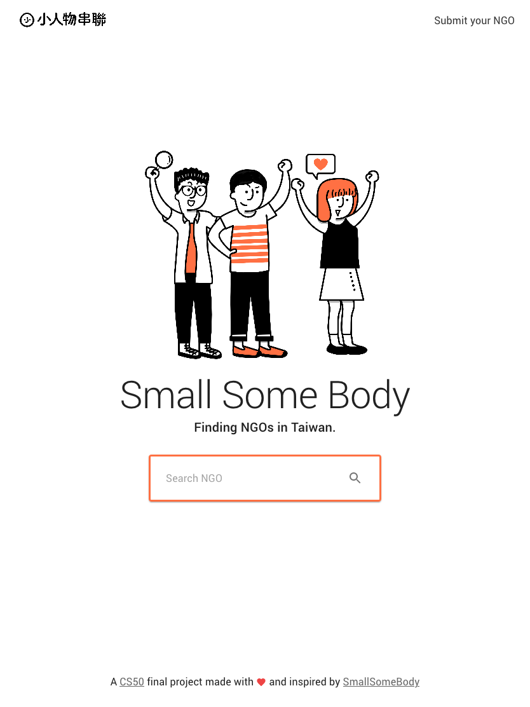

# [Small Some Body demo](https://lipeijia.github.io/small-some-body)

- 模仿網站：[小人物串聯](https://smallsomebody.tw/) 搜尋/新增 NGO。
- 在首頁搜尋欄輸入組織名稱，按搜尋即會在搜尋結果跳出符合或不符合的資訊。或直接按搜尋，跳出目前 app 所有的組織。可點擊卡片看更詳細的組織資訊。或新增自己的組織。
- 使用 [create-react-app](https://create-react-app.dev/) 與 [Material-UI](https://material-ui.com/) 製作。
- 響應式設計。




### 檔案結構:

```
/node_module
/public
  |-index.js
  |-favi.ico
  /images
/src
  |-App.js
  |-App.text.js
  |-index.js
  |-orgs.json
  /components
    |-Footer.js
    |-Navbar.js
    |-OrgCard.js
    |-SearchBar.js
    /controls
      |-inputs.js
      |-MultiSelect.js
    /hooks
      |-useForm.js
    /pages
      |-Home.js
      |-NewOrg.js
      |-Org.js
      |-OrgList.js
|-package.json
|-README.md
```

### `src` folder

1. **control file**

   - `index.js` app 主要入口。
   - `app.js` 控制 routes 與主要存資料的地方。使用 [React Router](https://reactrouter.com/)。

2. **pages folder**
   主要有四支 js 控制頁面：

   - `Home.js` : 首頁。
   - `OrgList` : 搜尋結果頁。
   - `NewOrg.js` : 新增組織。
   - `Org.js` : 組織詳細頁。

3. **components folder**
   重複使用各個頁面的元件：

   - `Navbar.js`：menu
   - `Footer.js`：footer
   - `SearchBar.js`：首頁的搜尋吧
   - `OrgCard.js`：在搜尋結果頁重複出現的卡片樣式
   - `Controls`：新增頁面的 input 樣式： `Input.js` 與下拉式樣式：`MultiSelect.js`

4. **hooks folder**

   - `useForm`：把新增組織的資料邏輯抽出。

5. **orgs.json**
   初始資料。

### Available Scripts:

In the project directory,
first run `yarn install` to install the node_modules,

- then run `yarn start` to run the app in the development mode.\
  Open [http://localhost:3000/small-some-body](http://localhost:3000/small-some-body) to view it in the browser.
  The page will reload if you make edits, you will also see any lint errors in the console.

- or run `yarn build` to builds the app for production to the `build` folder.\
  It correctly bundles React in production mode and optimizes the build for the best performance.
